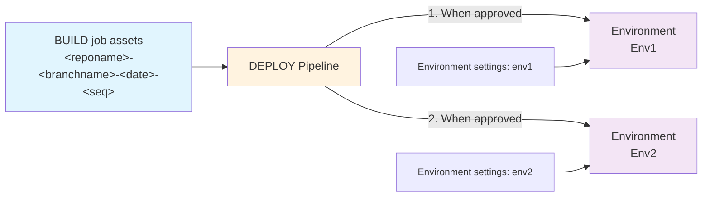

# Deploying

The `DEPLOY-<branchname>` pipeline deploys the assets from a set of build assets (chosen when it is started) and deploys them to one or more environments combining with environment specific settings.

The pipeline triggers automatically when the `BUILD` job completes successfully and triggers an instance associated with that release.

It is also possible to manually trigger the pipeline, select the relevant BUILD job from the 'resources' section (to specify the version) and choose which stages to run (to specify the environment(s)), if you need to make an exception for some reason.

> **Which environments?**
>
> Each `DEPLOY-<branchname>.yml` pipeline/workflow is associated with a single branch and must be edited to add a list of environments to deploy to, in sequence.
>
> **Azure DevOps**: Each environment requires a [service connection](../config/azdo-environment-service-connection.md) for auth and a [variable group](../config/azdo-environment-variable-group.md) for environment-specific values. Add the following variable group policies:
> - **Exclusive lock** — ensures only one deployment at a time can touch the environment.
> - **Approval** — requires approvers to sign off before deployment starts.
>
> **GitHub Actions**: Each environment requires [variables and secrets](../setup/github-variables.md) configured in a GitHub environment or as prefixed repo-level secrets. Add required reviewers on the GitHub environment for approval gates (requires Pro/Team/Enterprise for private repos; see [deployment gates](github-setup.md#deployment-gates-for-github-free) for alternatives).

To monitor:

**Azure DevOps:**
1) Navigate to the **Pipelines** area of your AzDO project.
2) Select the **All** tab and navigate to the folder with the same name as your repo.
3) Select the `DEPLOY-<branchname>` pipeline and then select an instance of the job.
4) Each environment is displayed as a **Stage** with a status showing which one is currently active.
5) If the stage is pending approval, an approval request is shown. The configured approvers must approve before deployment starts.
6) Once approved, the deployment stage starts. Select the stage to follow progress and check it completes successfully.

**GitHub Actions:**
1) Navigate to the **Actions** tab of your repository.
2) Select the **DEPLOY-main** (or your branch) workflow from the left panel.
3) Select the running workflow run. Each deployment stage is shown as a job.
4) If an environment has required reviewers configured, a review request is shown. Approvers must approve before the stage runs.
5) Select a job to follow its progress and check it completes successfully.

Once a stage completes successfully, the next stage will be started.

If a stage fails, you can see the detailed error. You can select 'Retry stage' to give it another go.

What happens for each deployment stage:

- **The pipeline waits for all configured policies to be met.**
  For instance the exclusive lock and approval steps.
- **The build assets generated by the selected instance of `BUILD` are downloaded.**
  This defaults to the triggering instance when the deployment job starts automatically, or can be selected manually when triggering manually.
- **The name of the deployment job matches the release number.**
- **Environment settings are read from the configuration associated with the environment** (Azure DevOps: variable group; GitHub Actions: GitHub environment secrets/variables or prefixed repo-level secrets), matching with those required by each solution.
- **Solutions are deployed if needed in the configured dependency order**:
  - If the solution is already present with the same version, the import is skipped.
  - If the solution is not currently present in the environment, the 'Import' method is used
  - If there's a pending unmerged upgrade with a different version, an error is thrown with details asking you to resolve it. This is not automated because it can result in data loss. You either need to remove (warning - data loss) or apply the prior upgrade before retrying.
  - If there's a pending upgrade for the same version, the 'Stage for upgrade' is skipped
  - If the solution is already present with a different version the 'Update' (if Major.Minor matches) or 'Stage for Upgrade' method is used 
- **If you've configured any `dataMigrations` hook extensions in `alm-config.psd1`, these will be executed**.
  This stage is designed to let you run steps that need both the old and new components to be present. For instance, moving data from an old/obsolete column (which is no longer present in the solution version being upgraded to) and into a new column.
- **Solutions that have a pending upgrade then have them applied in reverse dependency order**.
- **If you've configured any hook extensions in `alm-config.psd1`, these will be executed and can add to the deployment steps consuming files from the build assets.**
   For example, you might deploy data you captured during export.