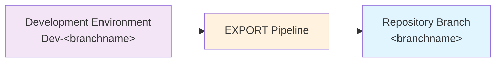

# Exporting Changes

The `EXPORT` pipeline for each repo takes the state of the solution(s) (and other assets like data if you include them) in your development environment, and exports them to the source control repo.

> **When to export changes**
>
> You should export changes frequently. There's no need to wait until you're ready to deploy. Exporting saves your work into source control where it's safe as well as creating a useful history at every point you run it.
>
> Exporting takes all changes to the configured solutions (and other assets) from the associated environment. There is deliberately no method to select and segregate changes. So you might need to co-ordinate with other changes you or team members have made.

> **Which environment?**
>
> ALM4Dataverse uses a convention-based approach to associate each branch with a development environment:
> - **Azure DevOps**: looks for a service connection named `Dev-<branchname>` (e.g. `Dev-main`).
> - **GitHub Actions**: uses the GitHub environment named `Dev-<branchname>` (e.g. `Dev-main`).

**Azure DevOps:**
1) Navigate to the **Pipelines** area of your AzDO project.
2) Select the **All** tab and navigate to the folder with the same name as your repo.
3) Select the `EXPORT` pipeline and click **Run pipeline**.
4) If you're using multiple branches, select the correct branch. Otherwise it defaults to `main`.
5) Enter the commit message.
   This is the message that will be logged in source control history. If you include ticket numbers in `#1234 #2345` format, the changes will also be shown against those tickets in the 'Development' section.
6) Click **Run**. The view will switch automatically to show progress. Wait until it is shown as successful.

**GitHub Actions:**
1) Navigate to the **Actions** tab of your repository.
2) Select the **EXPORT** workflow and click **Run workflow**.
3) If you're using multiple branches, select the correct branch. Otherwise it defaults to `main`.
4) Enter the commit message and click **Run workflow**.
5) Select the running workflow run to follow its progress. Wait until it is shown as successful (green checkmark).

What happens:

- Solutions are exported and unpacked (using PAC solution unpack) to `solutions/<uniquename>`
- If any changes were detected in a solution, the version number will be automatically incremented in your dev environment and the exported solution folder.
- If you've configured any hook extensions in `alm-config.psd1`, these will be executed and can add to the exported changes that get committed to your repo. For example, you can include configuration data.
- Changes (if any) are committed with the comment you provided and pushed back to the repo.
  The details of the person who triggered the pipeline will be used as the author.

What to do next:

- The `BUILD` pipeline triggers automatically when any change is made in a repo. This includes when `EXPORT` completes (if any changes were detected).
  See [Building Releases](building-releases.md) for information.

## Viewing Exported Changes

**Azure DevOps:**
1) Navigate to **Repos** in Azure DevOps and select the correct repo and branch.
2) Switch to the **History** view.
3) Each commit is displayed with its message. Click a commit to see the full set of changes.

**GitHub:**
1) Navigate to your repository and select the correct branch.
2) Click **Commits** (shown above the file list).
3) Each commit is listed with its message. Click a commit to see the full diff.