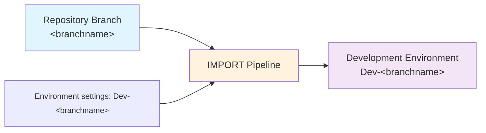

# Importing Changes

The `IMPORT` pipeline for each repo is used:

- When you have an empty development environment and you want to seed it from source control so you can start development.
- When you have an existing development environment and you want to update it with any changes from source control.

> **Which environment?**
>
> ALM4Dataverse uses a convention-based approach to associate each branch with a development environment:
> - **Azure DevOps**: looks for a service connection named `Dev-<branchname>` (e.g. `Dev-main`).
> - **GitHub Actions**: uses the GitHub environment named `Dev-<branchname>` (e.g. `Dev-main`).

**Azure DevOps:**
1) Navigate to the **Pipelines** area of your AzDO project.
2) Select the **All** tab and navigate to the folder with the same name as your repo.
3) Select the `IMPORT` pipeline and click **Run pipeline**.
4) If you're using multiple branches, select the correct branch. Otherwise it defaults to `main`.
5) Click **Run**. The view will switch automatically to show progress. Wait until it is shown as successful.

**GitHub Actions:**
1) Navigate to the **Actions** tab of your repository.
2) Select the **IMPORT** workflow and click **Run workflow**.
3) If you're using multiple branches, select the correct branch. Otherwise it defaults to `main`.
4) Click **Run workflow**. Select the running workflow run to follow its progress. Wait until it is shown as successful (green checkmark).

What happens:

- The import process follows the same steps as `DEPLOY` except:
  - it uses the latest files from the repo
  - it imports an unmanaged solution instead of a managed solution.
- Where connection references, environment variables, and other settings are required, they are read from the environment configuration:
  - **Azure DevOps**: the `Environment-Dev-<branchname>` variable group. See [variable group configuration](../config/azdo-environment-variable-group.md).
  - **GitHub Actions**: the `Dev-<branchname>` GitHub environment secrets/variables (or prefixed repo-level secrets). See [GitHub variables & secrets](../setup/github-variables.md).